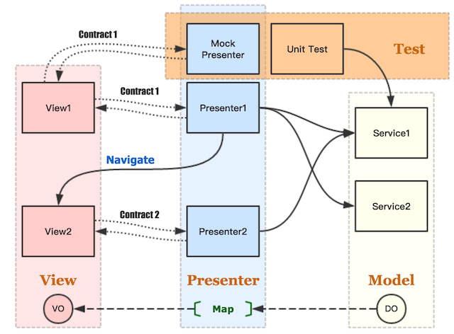

# README

[](http://www.apache.org/licenses/LICENSE-2.0.html)

## Create Template Project
Just paste and execute the following command at a terminal prompt. It can help you to create a new template project fast.

```bash
python -c "$(curl -fsSL https://raw.githubusercontent.com/nekocode/Kotlin-Android-Template/master/project_creator.py)"
```

This python script depends on the [`requests`](http://docs.python-requests.org/en/master/user/install/) lib.

## Description
This is an Android project template using [**Kotlin**](https://kotlinlang.org)/**MVP** architecture.



### Package structure
```
cn.nekocode.kotgo.sample
├─ data
│  ├─ DO
│  └─ service
│ 
├─ page
│  └─ screen_one
│     ├─ Contract.kt
│     ├─ Presenter.kt
│     └─ Activity.kt
│
└─ App.kt
```

### Sample
Thanks to **[gank.io](http://gank.io/)**. The sample app use APIs provided by it.

